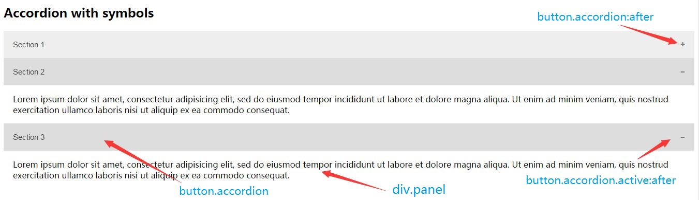

# 手风琴

## 前言

手风琴就是可折叠面板，通过点击来折叠面板，同时会有符号变化。

## HTML结构
一个`button`和一个`div`组合起来实现手风琴效果，其中`div`存放内容。

## CSS样式
`div.panel`是通过`height`效果来实现变化。

`button.accordion`的变换通过伪类`:after`实现

## JavaScript
监听按钮点击事件，切换`.active`类名，通过判断`maxHeight`样式是否有值，如果有值，则为空，如果没值，则通过`scrollHeight`设定`maxHeight`，