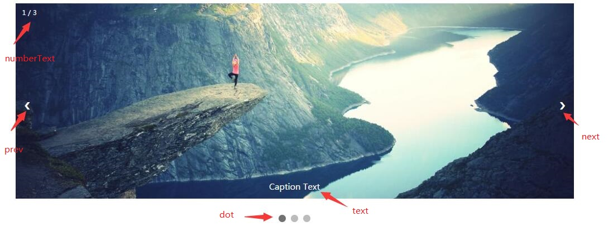

# 幻灯片
## HTML结构

按照上图实现html结构

## CSS
编写CSS，需注意以下几点：
- 整个容器保持水平居中
- `numberText`类需要处于左上角
- `prev`和`next`类在图片的垂直居中位置，每次划过时，会有背景色变化。
- `text`处于图片的垂直居中
- `dot`通过`boreder-radius`实现圆形，会有背景色动画和鼠标手势变化。
- 图片切换时，会有从半透明到实的动画

## JavaScript
每次变化都是通过`showSlides()`函数实现，此函数思路是：将所有照片`display`样式隐藏，所有`dot`的类名去除`active`，将要显示的照片`display`样式设为`block`，`dot`类加上`active`。

箭头切换时，同样调用`showSlides()`函数，只是改变传入参数。

点击点时，也是同样道理。

## 拓展
如果想变成自动播放，则去除左右箭头结构和事件。将JavaScript改成下面形式：
```javascript
var slideIndex = 0;
showSlides();

function showSlides() {
    var i;
    var slides = document.getElementsByClassName("mySlides");
    for (i = 0; i < slides.length; i++) {
        slides[i].style.display = "none"; 
    }
    slideIndex++;
    if (slideIndex> slides.length) {slideIndex = 1} 
    slides[slideIndex-1].style.display = "block"; 
    setTimeout(showSlides, 2000); // 每二秒改一次
}
```