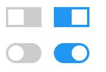

# Toggle Switch

## 前言
本例通过css实现开关的切换，效果如下：

## HTML结构
用`label`标签包装`input`，其中`div`为图中开关

## CSS样式
- 外部容器为宽60px、高34px。里面开关使用div的伪类实现，宽高为外部的一半，所以其宽为26px，高为26px（因为其定位距离外部的左4px，底4px）
- 点击时，通过`translate`来实现开关效果
- 圆形开关通过`border-radius`实现
